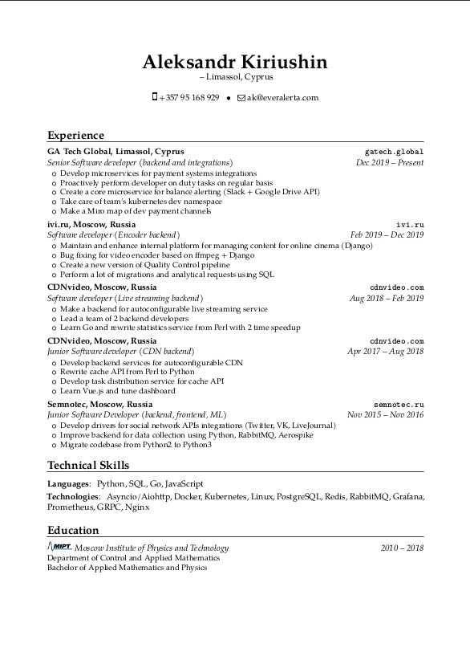
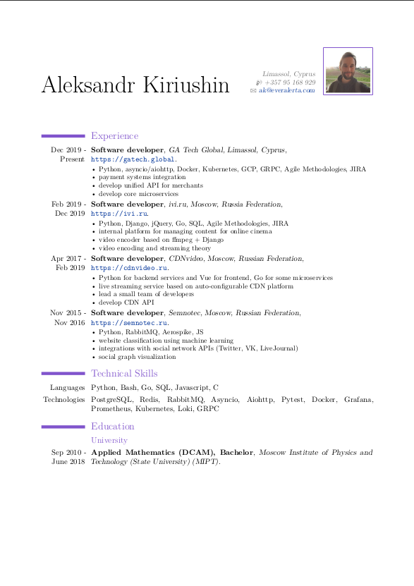

# CV
This is a source code for compiling my CV.

CV's template is [moderncv](https://github.com/xdanaux/moderncv).

# How to make a pdf

To create a file cv.pdf you need to have a latex program then you should run this command:
```
make build
```

For checking the CV after changes you could use the command (it depends on evince pdf viewer):
```
make view
```

# Tailoring process

The process of tailoring is based on advices from ["The Tech Resume Inside Out"](https://thetechresume.com/) book.

<div style="display: flex">
<h3>v2</h3>

<h3>v1</h3>

</div>
